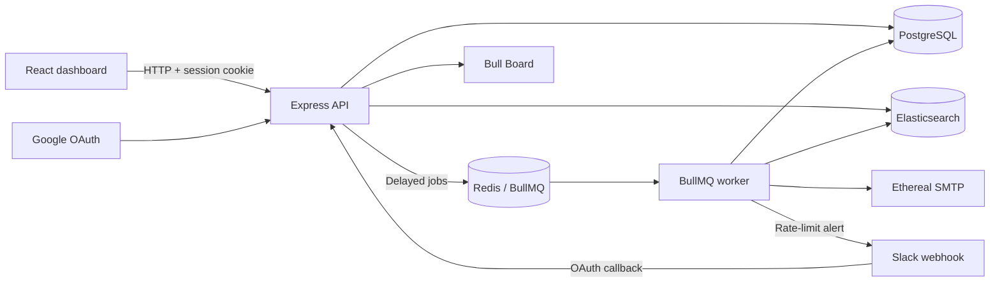

# ReachInbox Email Scheduler

A full-stack email scheduling assignment built with TypeScript, Express, BullMQ, Redis, PostgreSQL, Elasticsearch, React, and Ethereal Email.

> **Current status:** project foundation and parallel-development documentation are ready. Backend, worker, frontend, and shared packages are not implemented yet.

The complete product requirements live in [`specification.md`](specification.md). If another document conflicts with it, the specification wins.

## Target architecture



- PostgreSQL is the source of truth for users, senders, integrations, and email state.
- BullMQ delayed jobs provide persistent scheduling without cron.
- Redis stores the queue, retry state, and cross-worker rate-limit counters.
- The worker sends through Ethereal and updates PostgreSQL and Elasticsearch.
- Elasticsearch provides tenant-filtered search over scheduled and sent emails.

## Repository layout

```text
.
├── backend/              Express API and BullMQ producer
├── frontend/             React and Tailwind dashboard
├── worker/               BullMQ consumer and email delivery
├── packages/             Shared DB, search, and contracts (created by Person 4)
├── tasks/                Four parallel implementation guides
├── AGENTS.md             Automatic instructions for coding agents
├── specification.md      Authoritative assignment requirements
├── docker-compose.yml    PostgreSQL, Redis, and Elasticsearch
└── .env.example          Local infrastructure defaults
```

## Start local infrastructure

### Prerequisites

- Docker with Docker Compose
- Node.js and npm will be required after the application workspaces are created

### Run

```bash
cp .env.example .env
docker compose up -d
docker compose ps
```

Local services:

| Service | Address | Purpose |
| --- | --- | --- |
| PostgreSQL | `localhost:5432` | Relational source of truth |
| Redis | `localhost:6379` | BullMQ queue and rate limiting |
| Elasticsearch | `http://localhost:9200` | Email search index |

Check Elasticsearch:

```bash
curl http://localhost:9200/_cluster/health
```

Stop the services without deleting persisted data:

```bash
docker compose down
```

The Compose setup uses named volumes for PostgreSQL, Redis, and Elasticsearch. Do not use `docker compose down --volumes` when testing restart persistence.

The credentials in `.env.example` are local-development defaults only.

## Parallel development

Read the [team coordination guide](tasks/README.md) first. Work is divided into four independently owned tasks:

1. [Backend API](tasks/backend/README.md)
2. [BullMQ worker](tasks/worker/README.md)
3. [Frontend dashboard](tasks/frontend/README.md)
4. [Platform and integration](tasks/platform/README.md)

Person 4 lands the shared foundation first. The other three owners then branch from the updated `main` and work only inside their assigned directory. Person 4 owns the root lockfile, shared packages, migrations, and final integration.

Coding agents automatically read [`AGENTS.md`](AGENTS.md). A task owner can start with a short instruction such as:

```text
Implement the worker task.
```

## Required end-to-end behavior

- Real Google login and application session.
- Real Slack OAuth connection, disconnection, and rate-limit notification.
- Batch scheduling from uploaded CSV/text leads.
- BullMQ delayed jobs with configurable worker concurrency and retries.
- Minimum spacing and Redis-backed per-sender hourly limits across workers.
- Excess jobs delayed into the next hour instead of dropped.
- Persistent jobs and email state across application restarts.
- Idempotency protection against duplicate processing.
- Ethereal delivery with stored message and preview information.
- Searchable scheduled and sent emails in Elasticsearch.
- Authenticated Bull Board queue dashboard.
- Scheduled and sent frontend views with loading, empty, and error states.

## Final verification

Before submission, verify this sequence with real credentials:

1. Sign in with Google and connect Slack.
2. Upload recipients and schedule future emails.
3. Restart the backend and worker before the scheduled time.
4. Confirm each future email remains queued and sends once.
5. Confirm sent state appears in PostgreSQL, Elasticsearch, Bull Board, and the frontend.
6. Set a low hourly limit, verify excess jobs are delayed, and receive one live Slack alert.

The final implementation README must also document setup for Google, Slack, and Ethereal credentials, architecture trade-offs, commands for all workspaces, and the demo-video workflow.
