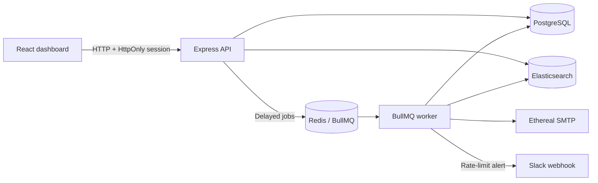

# ReachInbox Email Scheduler

A TypeScript monorepo for the ReachInbox full-stack email-scheduler assignment. [`specification.md`](specification.md) is authoritative; [`tasks/README.md`](tasks/README.md) defines the four-person split.

> **Current status:** Docker infrastructure, workspace manifests, shared contracts, Prisma database package, encrypted Slack-secret helper, and Elasticsearch package exist at code level. Backend, worker, and frontend source code—and full workspace and real-integration verification—remain unfinished.

## Architecture



- PostgreSQL is authoritative for users, senders, integrations, and email state.
- Redis persists BullMQ delayed jobs, retry state, and atomic rate-limit counters.
- Elasticsearch is a tenant-filtered search projection, never authoritative storage.
- One database email row maps to one deterministic BullMQ job, `email-<database-id>`.
- Google login and Slack connection are real OAuth flows; secrets stay server-side.

## Repository layout

```text
backend/             Express API and BullMQ producer
frontend/            React, Vite, and Tailwind dashboard
worker/              BullMQ consumer and email delivery
packages/contracts/  Shared queue and HTTP types
packages/db/         Prisma schema/client and Slack-secret encryption
packages/search/     Elasticsearch mapping, indexing, tenant search
tasks/               Parallel implementation guides and TODO ledgers
```

## Local setup

Requires Docker Compose, Node.js 22.12+, and npm.

```bash
cp .env.example .env
npm install
npm run infra:up
npm run db:generate
npm run db:push
npm run dev
```

`npm run dev` starts the backend, worker, and frontend together. The app workspaces currently have no source entry points, so it becomes usable after their implementation tasks land.

Useful commands:

```bash
npm run infra:logs
npm run build
npm run typecheck
npm test
npm run infra:down
```

Named volumes preserve PostgreSQL, Redis, and Elasticsearch data across `docker compose down`. Do not add `--volumes` when testing restart persistence.

Local endpoints are PostgreSQL `localhost:5432`, Redis `localhost:6379`, Elasticsearch `http://localhost:9200`, backend `http://localhost:3000`, and frontend `http://localhost:5173`.

## External credentials

Copy `.env.example`, then replace every `replace-with-*` value.

### Google

Create a Google web OAuth client, allow `http://localhost:5173` as an authorized JavaScript origin, and put the same client ID in `GOOGLE_CLIENT_ID` and `VITE_GOOGLE_CLIENT_ID`. The backend must verify the returned ID token and create its own HttpOnly session.

### Slack

Create a Slack app with the `incoming-webhook` OAuth scope and register the exact `SLACK_REDIRECT_URI`. Set the client ID and secret, then replace the development encryption key:

```bash
openssl rand -base64 32
```

The backend stores the webhook encrypted per user. Disconnect deletes that connection; a missing connection makes worker notifications a safe no-op.

### Ethereal

Create a persistent test account at [Ethereal Email](https://ethereal.email/), then set `ETHEREAL_USER` and `ETHEREAL_PASS`. The worker will reuse one pooled Nodemailer transporter and store each message ID and preview URL.

## Scheduling and restart behavior

The intended API transaction stores one email row per unique recipient and then adds BullMQ delayed jobs in bulk. Redis AOF uses `appendfsync everysec`, the `noeviction` policy prevents queue keys being evicted under memory pressure, and named volumes survive container restarts. At worker startup, reconciliation re-adds unsent scheduled rows using deterministic job IDs. PostgreSQL status checks remain the duplicate-send guard; no cron or `QueueScheduler` is used.

Delayed jobs become eligible at their scheduled time but may wait for worker capacity. This behavior is not yet implemented or restart-tested.

## Concurrency, spacing, and hourly limits

The worker design uses:

- `WORKER_CONCURRENCY` for parallel BullMQ processing.
- A BullMQ limiter of one send per `MIN_SEND_DELAY_MS` for global minimum spacing.
- One atomic Redis operation keyed by sender and UTC hour, capped by the lower of the sender limit and `MAX_EMAILS_PER_HOUR`.
- Delaying excess jobs until the next hour instead of dropping them.
- One Redis notification marker per sender/hour so connected Slack receives one live alert.

These worker behaviors remain unimplemented and unverified.

## Development workflow

The root is an npm workspace. Shared packages build before apps because `packages/*` appears first in the workspace list. Ownership and branch rules are in [`AGENTS.md`](AGENTS.md). Each owner maintains progress in its own `tasks/<task>/TODO.md` and checks an item only after the implementation or verification is complete.

- [`tasks/backend/README.md`](tasks/backend/README.md)
- [`tasks/worker/README.md`](tasks/worker/README.md)
- [`tasks/frontend/README.md`](tasks/frontend/README.md)
- [`tasks/platform/README.md`](tasks/platform/README.md)

Only Person 4 creates and updates the root `package-lock.json`.

## Known trade-offs and verification gaps

- Elasticsearch security is disabled in Compose for local development only.
- Redis AOF `everysec` can lose roughly the latest second of writes after host failure; PostgreSQL reconciliation is the recovery path.
- SMTP cannot guarantee strict exactly-once delivery if a worker dies after SMTP accepts a message but before the database update.
- Offset search pagination is capped at 100 results per page; add cursor pagination only if deep paging becomes necessary.
- Multiple sender addresses share one Ethereal SMTP account in the minimal implementation.
- Google OAuth, Slack OAuth/notification, Ethereal SMTP, restart persistence, load behavior, and tenant isolation have not yet been exercised end to end.

## Final demo checklist

After all app tasks land, verify with real credentials:

1. Sign in with Google and connect Slack.
2. Upload recipients and schedule a future batch.
3. Restart the backend and worker before the scheduled time.
4. Confirm each email remains queued and sends once.
5. Confirm sent state in PostgreSQL, Elasticsearch, Bull Board, and the frontend.
6. Set an hourly limit of one, verify the second job is delayed, and receive one Slack alert.
